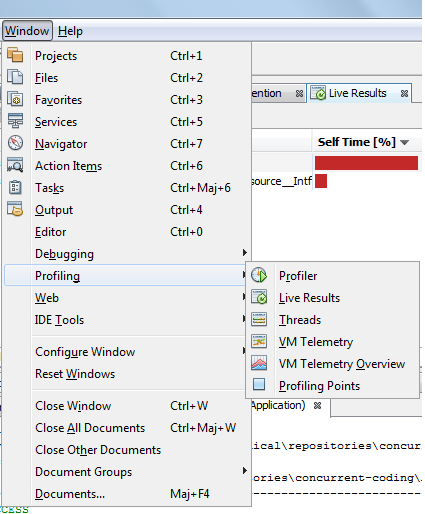
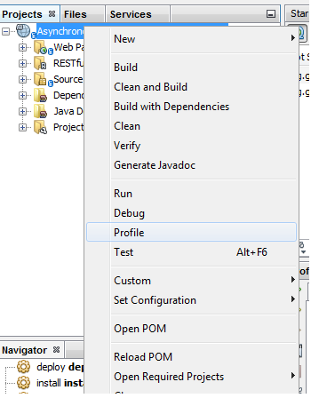
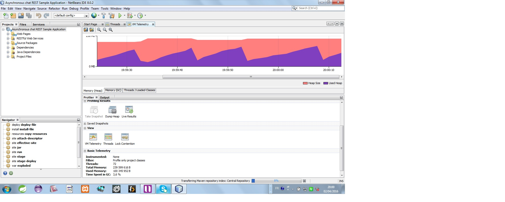
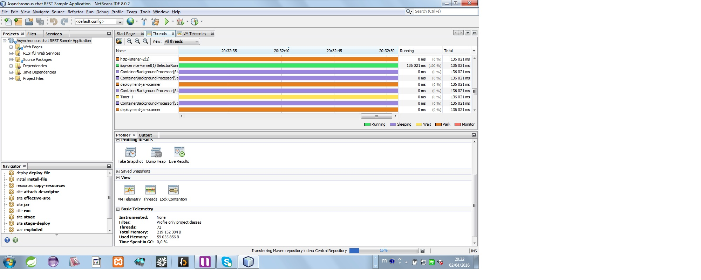
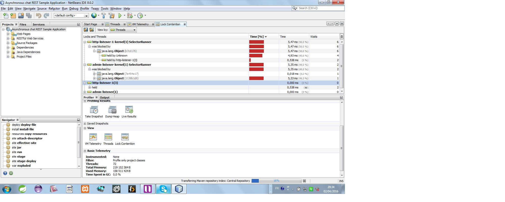

<h3>Profiling with netbeans profiler</h3>   
Netbeans is shipped with a very interesting profiler. It's very handy, powerful and simple to use.
In order to display you need to go to the following list of menus and menu items:  Windows ==> Profiling ==> Profiler   
 
   

You can position it as seems fit to you   
Then you can select a module or a project, open its contextual menu and lunch the profiler   
 
   
 
The viewing options are threefold:    
<ul>
	<li>The virtual machine's telemetry</li>
	<li>The threads</li>
	<li>The lock contention</li>
</ul>

The names of these categories speak largely by themselves, so I don't see the need to comment more than showing it with pictures   
 

<u>Figure a. vm's heap memory telemetry</u>   
   
 

<u>Figure b. vm's thread telemetry</u>   
   
 

<u>Figure c. vm's lock contention's telemetry</u>   
   
 